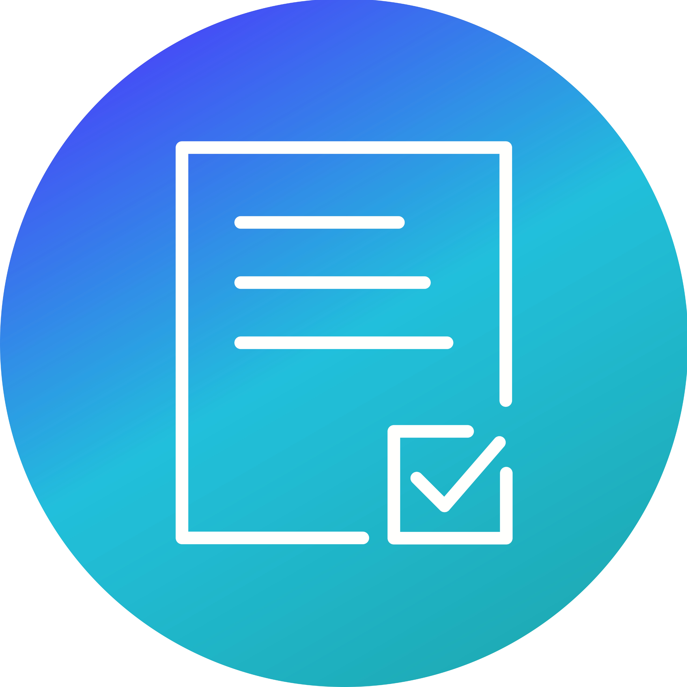
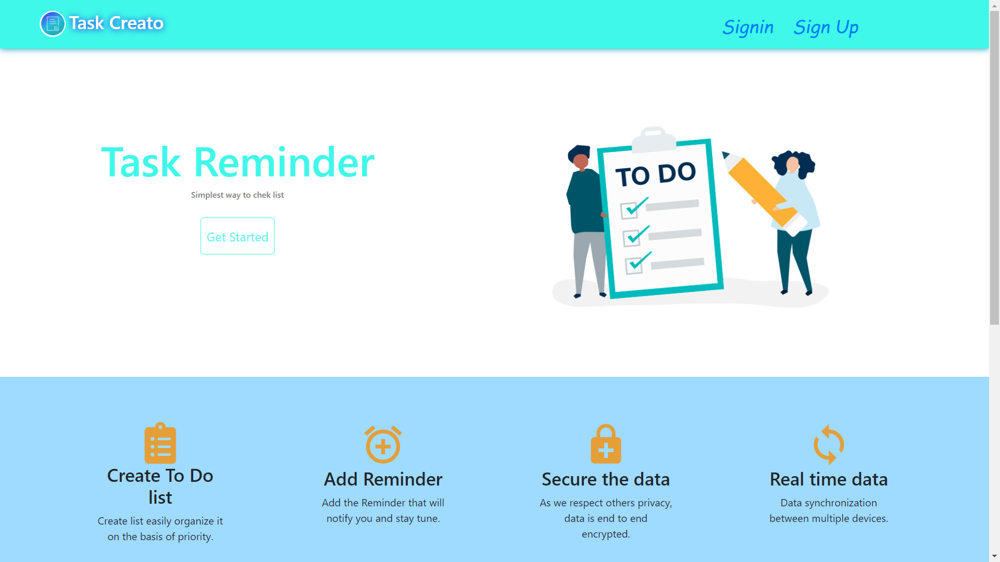
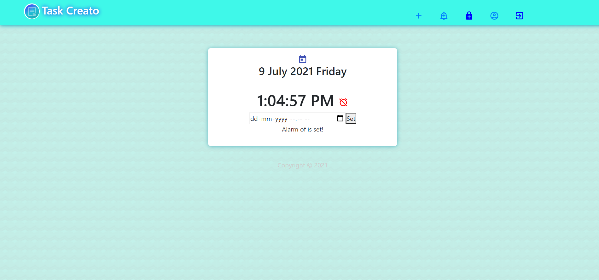
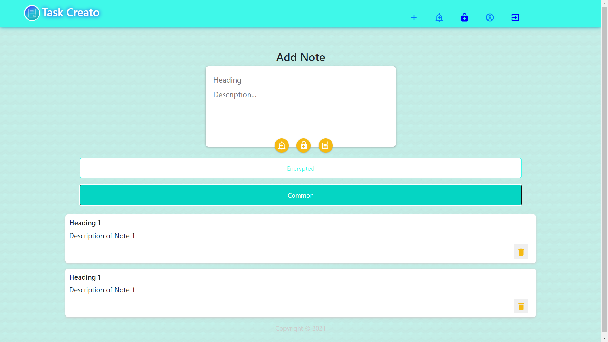

<p align="center">
  <a href="https://github.com/prathameshg121/ToDoReminder">
    
  </a>
<h1 align="center">Task Creato</h1>
  <p align="center">
    Easy to create secure notes and add reminder.
    <br /> 
    </p>
</p>
    
<!-- ABOUT THE PROJECT -->
## 📖About The Project
Task Creato helps to create notes vesy esaily. It also has the feature of alarm. We implemented End-to-end encryption so that personal data remain secure. The website is responsive so it can we easily use on multiple devices.

It has feature of real time synchoronization across mutiple device.

### 🔧**Project Setup**  

This project has two part - Frontend and Backend
To get a local copy up and running follow these simple example steps.

### Prerequisites
 You need to have pre-installed npm (a Node package manager)

### Installation

1. Clone the repo
   ```sh
   git clone https://github.com/CHAHATMB/ToDoReminder
   ```
2. Install NPM packages
   ```sh
   npm install
   ```

### Run

1. To run Frontend
   ```sh
   npm run client
   ```
2. To run Backend
   ```sh
   npm run server
   ```
3. To run in Development mode
   ```sh
   npm run dev
   ```

### 💻**Technology stack**
Tools and technologies that you learnt and used in the project:
1. MERN Stack
2. Bootstrap
3. Socket.io
4. Crypto-js (JS lib for encryption and decryption)
5. Git and Github

### ⚡**Applications**
+ You can use this app as a todo reminder for your task.  
+ You can set remainder in order to get notification at specific time.  
+ You can use this app to store some of your confidential notes.   


### 📸**Screenshots**
<h3>
Home page
</h3>


</br>
<a><h3>Reminder Page</h3>
</a>
<a><h3>Add Note Page</h3>
</a>

### 👨‍💻**Team members**
* Chahat Baghele
* Prathamesh Ghogare

<!-- LICENSE -->
## License

Distributed under the MIT License. See `LICENSE` for more information.
